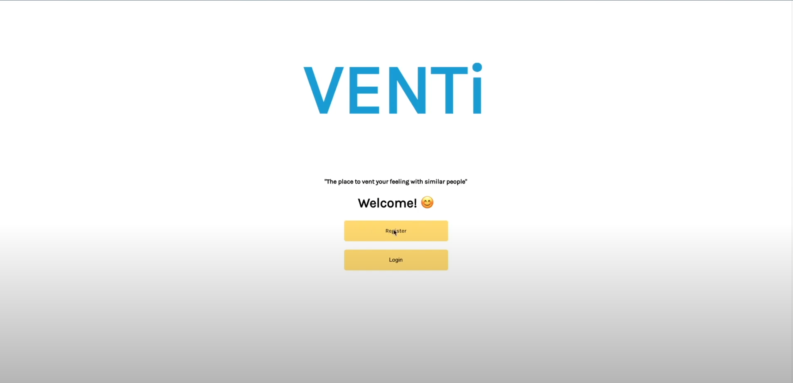
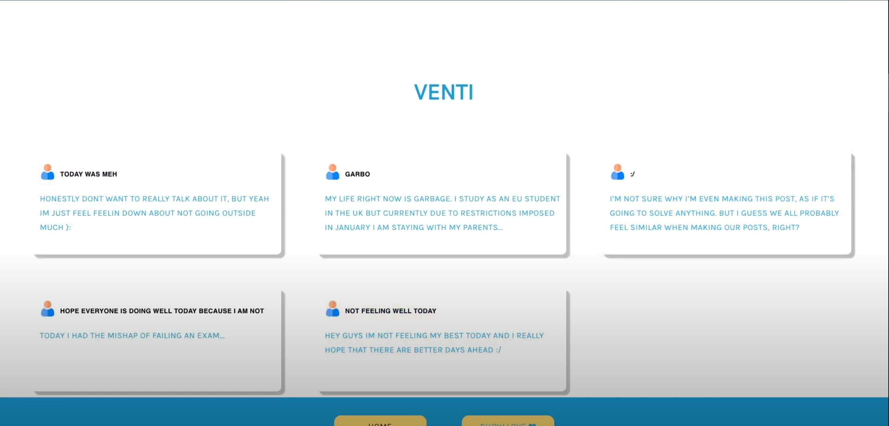
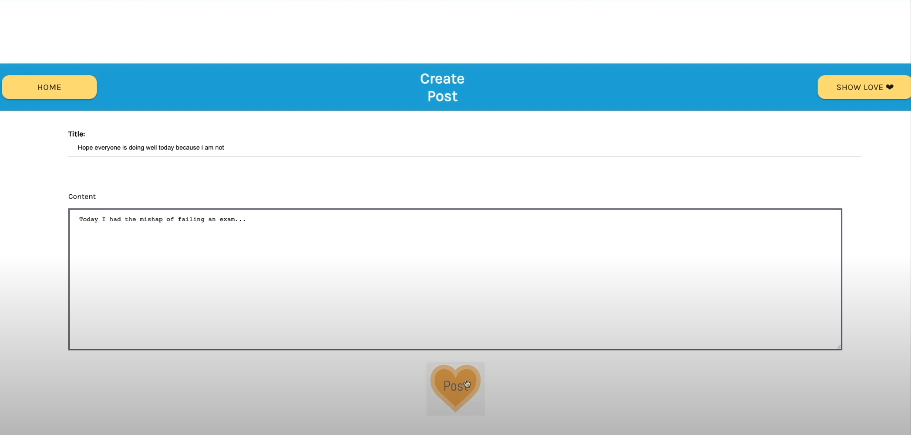
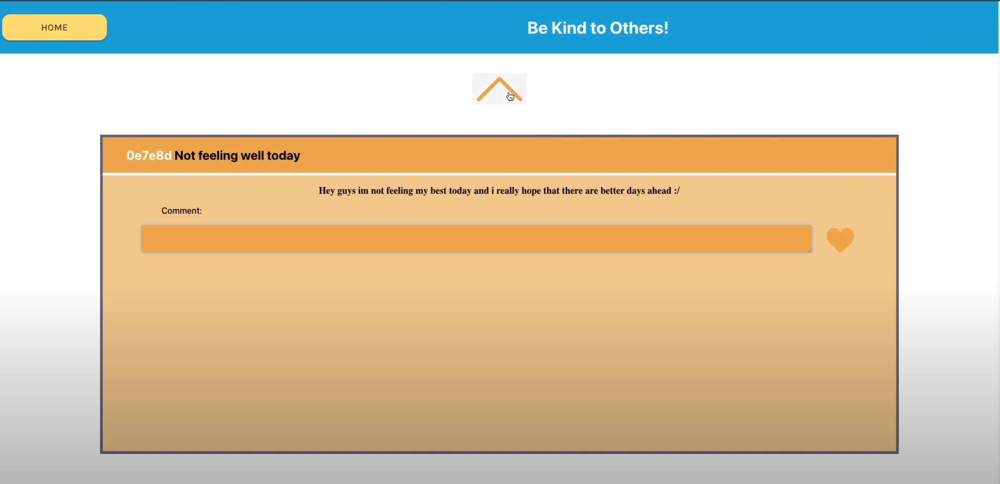

# Venti

Venti, is a platform where people can anonymously cheer people up, or vent to others and tell them about your days, where you will receive support from other people anonymously. These posts will show to other users based on how sad the post seems. We trained an AI to learn and compare sadness levels on the posts made by the users, and then it provides the users with posts that have the highest levels of sadness will show up first, so the people that seem to need the most support, will obtain it. Additionally, we also recommend to users posts that are similar to theirs by analyzing the similarly of the content of the users posts and others and recommending posts that are similar to a user. This is done so that users who may be feeling sad about a particular thing know that they are not the only one having the same experience.

## Demo

- [Video Link](https://youtu.be/jeY1jE3GkH0)
- [DevPost](https://devpost.com/software/venti)

## Preview

### Venti
<div align="center">
    
</div>

### Home Screen
<div align="center">
    
</div>

### Create Post
<div align="center">
    
</div>

### Show Love
<div align="center">
    
</div>

## Tech Stack

**Client:** React

**Server:** Node.js, Express.js, Python, Flask, Tensorflow, MySQL, Google Cloud, Heroku

## Features

- Ability to Create Post
- Ability to View Posts
- Posts are analyzed for emotions
- Share posts based on emotions

## Run Locally - FrontEnd

Clone the project

```bash
  git clone https://github.com/bzamora020/project-venti.git
```

Go to the project directory

```bash
  cd project-venti
  cd frontend
```

Install dependencies

```bash
  npm install
```

Start the server

```bash
  npm start
```

## Run Locally - BackEnd

Clone the project

```bash
  git clone https://github.com/bzamora020/project-venti.git
```

Go to the project directory

```bash
  cd project-venti
  cd backend
```

Install dependencies

```bash
  npm install
```

Start the server

```bash
  npm run start
```

## Authors

- [@bryanzamora](https://github.com/bzamora020)
- [@elmervasquez](https://github.com/elmerv)
- [@nabilkhalil](https://github.com/nabil-k)
- [@asarelcastellanos](https://github.com/AsarelCastellanos)